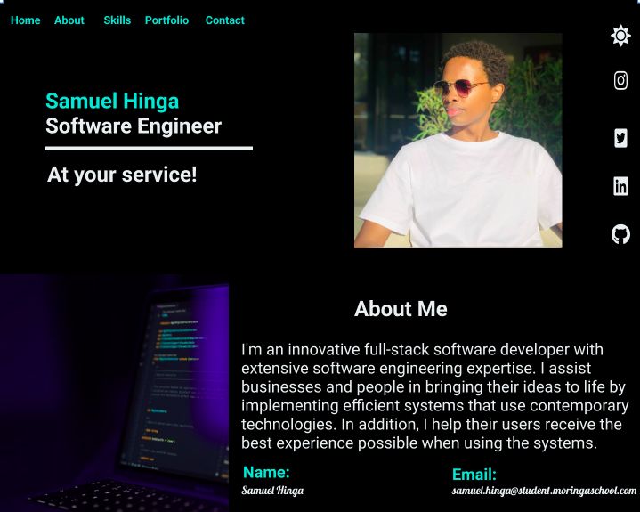

# SAMUEL HINGA PORTFOLIO

#### The website gives a brief overview of whom I am, Current version dates to 27th February 2022.
#### By **SAMUEL HINGA**
## Description
This web app contains my personal information and my level of expertise. Addition one can download my CV and get in touch with me.
## Design
The web app was designed using figma and one can click [here](https://www.figma.com/file/KnP5o6cL8Qkjiqeiw0gS3N/Portfolio?node-id=2%3A2) to view the it.
## Setup/Installation Requirements
* Hurp on to your browser,
* type the link,
* which will take you to the landing page,
* scroll over my portfolio,
* contact me on the contact me section to get intouch.
*The web app works perfectly and is independent of external sources. The site is well designed and is self-explanatory. To view my cv, click on the download button.For the perfect user experience, one can switch between light and dark mode.*
## Known Bugs
The app currently runs perfectly and has no known bugs.
## Technologies Used
The web app has incorporated HTML, CSS and JavaScript.
## Support and contact details
To add on the code, inform me of any bugs, or reach out to me generally, one can contact me [here](mailto:samuelkinuthia700@gmail.com).
### License
*The code is open source and under MIT license*
Copyright (c) 2022 **Samuel Hinga**